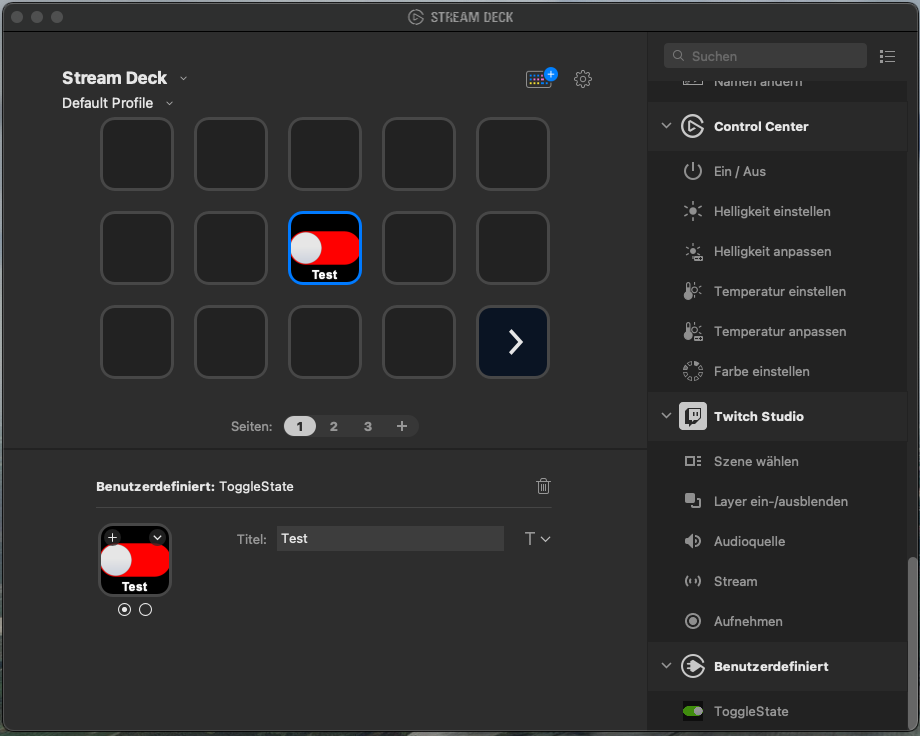

# streamdeck-togglestate

An [Elgato Stream Deck](https://www.elgato.com/de/stream-deck) plugin to switch between two states to enable having checklists in your live stream production.

> I like to use those for everything non-tech-related, like reminding me of having a bottle of water and a cup of ready before going live.



## Build

To build the plugin, use the `DistributionTool` by Elgato: [Exporting your plugin for distribution](https://developer.elgato.com/documentation/stream-deck/sdk/exporting-your-plugin/).

```sh
.\DistributionTool.exe -b -i Sources\dev.domnikl.togglestate.sdPlugin -o Release
```
